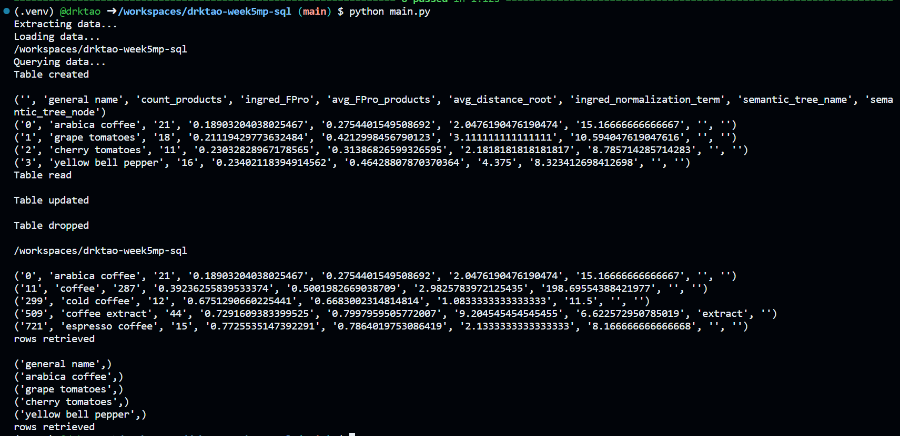

## SQL Project
In this project, I created python scripts to connect to the `GroceryDB` database and perform CRUD operations. I have three scripts within the `lib` folder, which perform the following tasks:
`extract.py` - extracts a dataset from a URL and creates a file path within the repo
`transform_load.py` - transforms and loads the dataset into the local SQLite3 database
`query.py` - performs a variety of queries on the database, including:
        `create_db()` - creates a new table with column names if needed
        `read_db()` - displays rows of the data
        `update_db()` - updates certain fields of the data
        `delete_tb()` - deletes a table from the database
        two additional queries that display rows based on certain conditions

As with many prior projects, the repo also contains the following files:
`Makefile` - commands for `make install`, `make format`, `make lint`, and `make test`
`requirements.txt` - lists necessary packages for this project
`main.py` - executes data extraction, loading, and querying
`main_test.py` - runs tests on all database queries

Below is a log of successful CRUD database operations, as well as successful tests.

